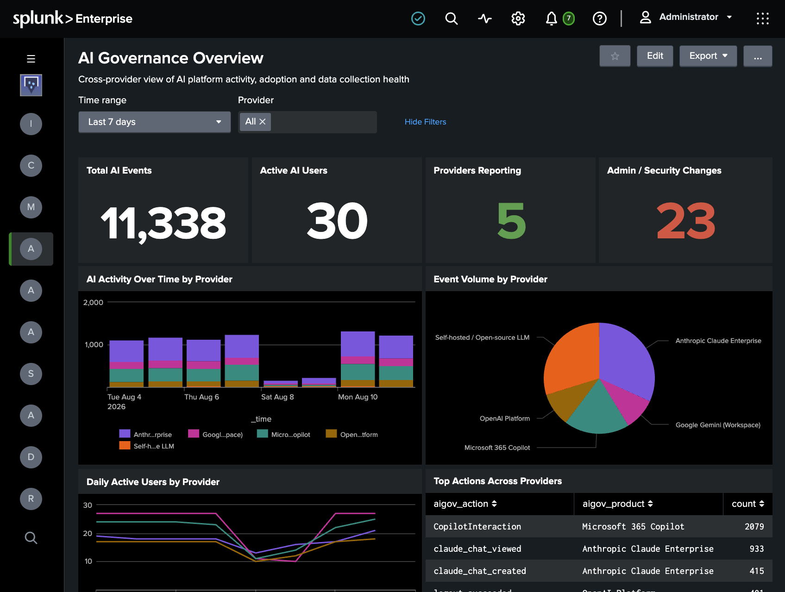
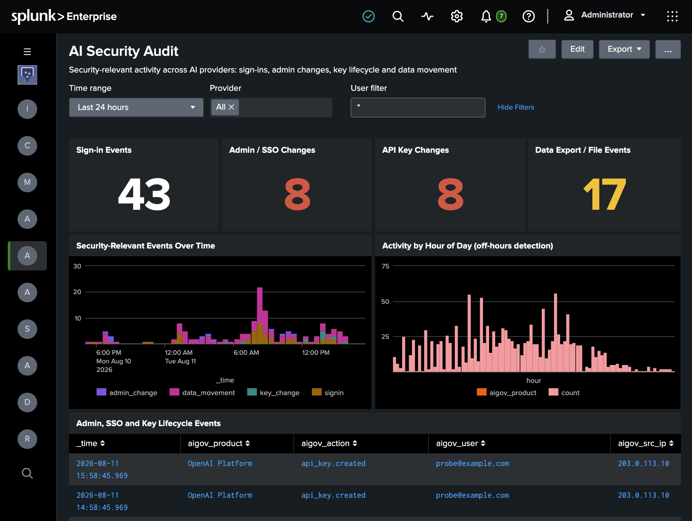
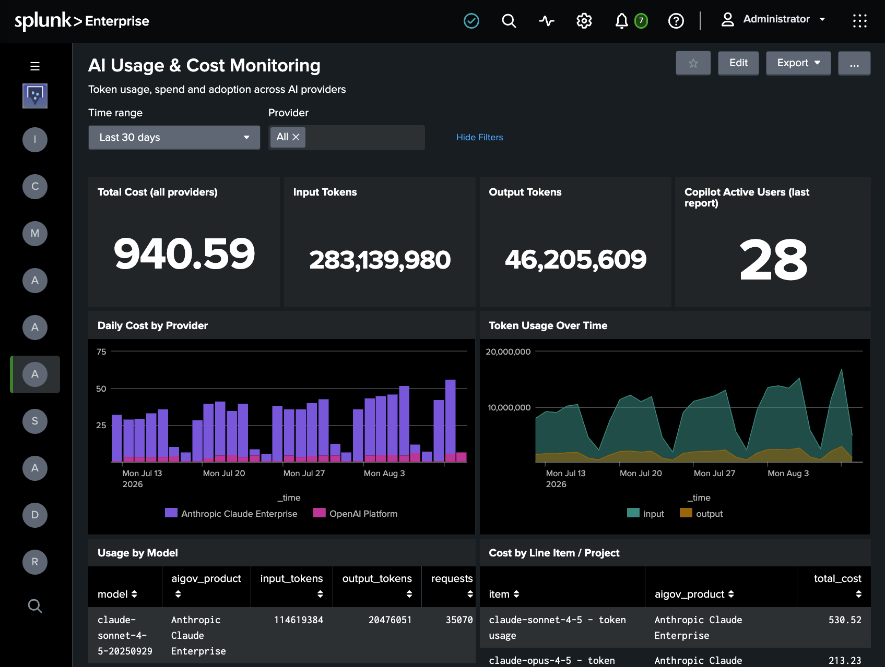
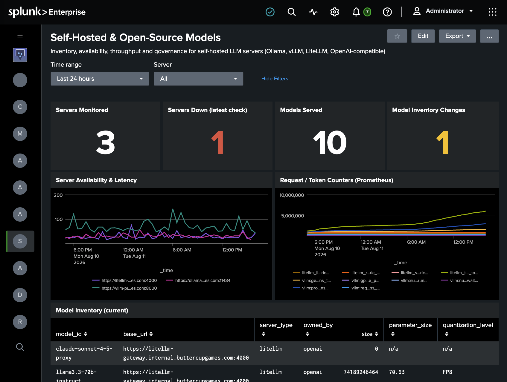
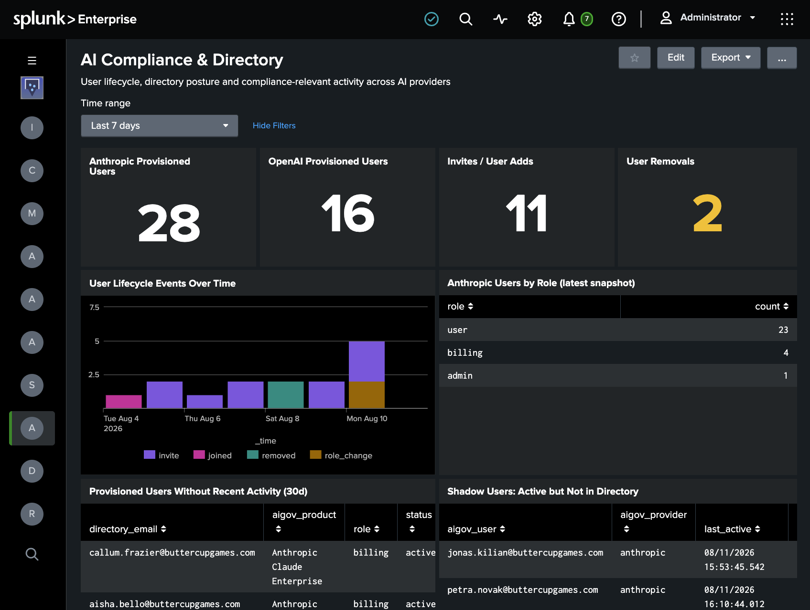

# Enterprise AI Governance Add-on for Splunk

The Enterprise AI Governance Add-on for Splunk (`TA-ai-governance`) collects audit, directory, usage, cost and health data from enterprise AI platforms into Splunk — one add-on, one normalized schema, provider-agnostic dashboards and alerts. Anthropic Claude Enterprise, OpenAI (ChatGPT Enterprise / API Platform), Google Gemini (Workspace), Microsoft 365 Copilot and self-hosted LLM servers land in the same index with the same field vocabulary, so a search, dashboard or alert written once works across every provider you run.

The add-on is built with the [UCC Framework](https://splunk.github.io/addonfactory-ucc-generator/) (`splunk-add-on-ucc-framework` 6.5.x), runs on the Splunk-bundled Python 3 interpreter, and uses `solnlib`, `splunktaucclib` and the Splunk Python SDK (bundled at build time — nothing to install separately).

Every provider permission the add-on asks for is a read scope: it does not modify your AI provider configuration, your users or your content. The only non-GET calls it makes are OAuth token requests (Google, Microsoft) and a POST that opens a Microsoft Graph audit-log query job, which is how that API returns Purview records.

## Features

* Data collection from five provider families, one input type per data domain:

  | Provider | Data collected | Inputs |
  |---|---|---|
  | Anthropic Claude Enterprise | Compliance API activity feed; users and groups directory; usage, cost and adoption analytics | `anthropic_compliance`, `anthropic_analytics` |
  | OpenAI (ChatGPT Enterprise / API Platform) | ChatGPT Enterprise compliance logs (end-user activity); platform organization audit logs (50+ event types); user directory; aggregated token usage; daily costs | `openai_compliance`, `openai_audit`, `openai_usage` |
  | Google Gemini (Workspace) | Admin SDK Reports API Gemini audit events (`gemini_in_workspace_apps`) | `gemini_audit` |
  | Microsoft 365 Copilot | Purview audit records (`copilotInteraction`) via Microsoft Graph; per-user usage reports | `copilot_audit`, `copilot_usage` |
  | Self-hosted LLM servers (vLLM, Ollama, LiteLLM, any OpenAI-compatible) | Model inventory, Prometheus metrics, runtime info, health checks | `selfhosted_monitor` |

* **Normalized schema** — every event carries `aigov_provider`, `aigov_product`, `aigov_category`, `aigov_action`, `aigov_user` and `aigov_src_ip`, so dashboards, macros and alerts work identically across providers.
* **Five dashboards** — AI Governance Overview (default view), AI Security Audit, AI Usage & Cost Monitoring, Self-Hosted & Open-Source Models, and AI Compliance & Directory.
* **Eight ready-made alerts** (shipped disabled) — API key lifecycle, admin/SSO changes, data exports, new users, off-hours spikes, spend thresholds, new self-hosted models, server-down.
* **KV Store checkpoints** (collection `ta_ai_governance_checkpoints`) — inputs resume where they left off across restarts; checkpoint storage is designed to support search head clustering (not yet validated).
* **Encrypted credentials** — all API keys and secrets are stored in Splunk secure storage, never in plain-text conf files.
* **Proxy support** — an optional per-account proxy URL routes provider traffic through your egress proxy.

## Getting Started

> The add-on polls each configured provider's admin/audit APIs on a schedule, normalizes the responses into `aigov_*` fields, and indexes them for the bundled dashboards and alerts.

### Requirements

* Splunk Cloud Platform, or Splunk Enterprise 10.x — standalone (distributed and search head cluster deployments are not yet validated).
* HTTPS egress from the instance running the inputs to the provider APIs you enable (or to your self-hosted LLM servers).
* Admin-level API credentials for at least one supported provider (see [Configuration](#configuration) for the exact keys, scopes and permissions).

### Installation

Download the packaged add-on from the [releases page](https://github.com/splunk-platform-apps/enterprise_ai_governance_add-on_for_splunk/releases) and install it following the [Splunk documentation](https://docs.splunk.com/Documentation/AddOns/released/Overview/Installingadd-ons).

**Install this add-on on the search head.** Dashboards, macros, alerts and the modular inputs all run there in the validated standalone topology. Distributed and search head cluster deployments are designed for (KV Store checkpointing keeps inputs restartable across members) but have not yet been validated — hold off on those topologies until a release announces support.

On Splunk Cloud, install as a private app (self-service app install / ACS).

### Configuration

Setup runs entirely through the add-on's configuration UI — no custom code or scripting. The steps below take roughly 15 minutes.

#### Step 1: Create an index

Create an events index for the data. This guide uses `ai_governance`.

#### Step 2: Gather provider credentials

This is the step worth doing carefully — most setup failures come from using a member-level key where an admin-level key is required.

| Provider | What you need |
|---|---|
| Anthropic Claude Enterprise | An Admin/Compliance API key (`sk-ant-admin...`, sent as `x-api-key`) for the activity feed and users/groups directory; optionally an Analytics key with the `read:analytics` scope (sent as a `Bearer` token) for usage, cost and adoption data |
| OpenAI (platform) | An organization **Admin API key** (`sk-admin-...`, sent as a `Bearer` token) with `api.audit_logs.read` and usage scopes. Only an organization **Owner** can create one, at platform.openai.com → **Settings → Organization → Admin keys**. Project keys (`sk-proj-...`) and user keys (`sk-...`) cannot read audit logs, and neither can an admin key minted without the audit-logs scope |
| OpenAI (ChatGPT Enterprise compliance) | A separate **Compliance API key** (sent as a `Bearer` token to `api.chatgpt.com`), plus the ChatGPT **workspace ID** (a UUID) or API Platform **organization ID** (`org-...`) it is scoped to. An organization **Owner** creates the key and OpenAI must approve the Compliance API scopes on it. Requires ChatGPT Enterprise, Edu or ChatGPT for Teachers — the platform Admin API key above will not work for this input, and vice versa |
| Google Gemini (Workspace) | An OAuth client ID and client secret plus a refresh token authorized by a Workspace admin for the scope `https://www.googleapis.com/auth/admin.reports.audit.readonly` |
| Microsoft 365 Copilot | An Entra ID app registration (tenant ID, client ID, client secret) with the application permissions `AuditLogsQuery.Read.All` and `Reports.Read.All`, admin-consented |
| Self-hosted LLM servers | Optionally a static API key (`Bearer` token). HTTPS with certificate verification is the default; plain HTTP is an explicit per-account opt-in for lab environments |

#### Step 3: Add provider accounts

Open **Configuration → AI Provider Accounts → Add**, pick a provider and enter its credentials. Add one account per provider, or per org/tenant if you have several. Each account also accepts an optional proxy URL. Every secret is stored encrypted in Splunk secure storage — nothing lands in plain-text configuration files.

#### Step 4: Create inputs

Open **Inputs → Create New Input**, pick the input type (`anthropic_compliance`, `anthropic_analytics`, `openai_compliance`, `openai_audit`, `openai_usage`, `gemini_audit`, `copilot_audit`, `copilot_usage` or `selfhosted_monitor`), select the account you created, and set **Index** to your index. Audit inputs backfill 7 days of history on their first run by default, so the dashboards have data immediately rather than filling in over the following week.

Two settings on **OpenAI Compliance Logs (ChatGPT Enterprise)** deserve a decision rather than a default:

* **Event types** — a comma-separated list of Compliance Logs event types, defaulting to `AUTH_LOG`. The set available to your workspace is listed in the Compliance API reference at `chatgpt.com/admin/api-reference`, which requires you to be signed in to your Enterprise or Edu workspace. Add the types you want; an unrecognized type is skipped with a warning and does not stop the others.
* **Index full message content** — off by default. When off, prompt and response text is replaced with a redaction marker and a character count while message roles, ids and timestamps are preserved, and events carry `aigov_content_redacted=true`. Turn it on only once you have confirmed the target index's retention, access controls and data classification allow storing conversation content verbatim.

The Compliance Logs Platform retains roughly 30 days of history, so the backfill window on this input is capped at 30 days and continuous collection is the point of running it.

#### Step 5: Point the `aigov_index` macro at your index

Every dashboard, macro and alert builds on one search macro. Under **Settings → Advanced search → Search macros** (app context `TA-ai-governance`), edit `aigov_index` and set its definition to `index=ai_governance`.

#### Step 6: Verify data is flowing

Wait one collection interval, then run:

```
| tstats count where index=ai_governance by sourcetype
```

Or, once the `aigov_index` macro is set:

```
`aigov_all` | stats count by aigov_provider, sourcetype
```

#### Step 7: Enable the alerts that match your policy

Under **Settings → Searches, reports, and alerts** (app context `TA-ai-governance`), enable the alerts you want and tune their thresholds. All eight ship disabled, so nothing fires until you decide it should.

Logging verbosity can be changed under **Configuration → Logging**.

### Usage

Open the dashboards from the navigation bar, starting with **AI Governance Overview** (the default view).

Category macros (`aigov_all`, `aigov_audit`, `aigov_directory`, `aigov_usage`, `aigov_cost`, `aigov_selfhosted`) and cross-provider action macros (`aigov_signin_actions`, `aigov_admin_actions`, `aigov_key_actions`, `aigov_export_actions`) are available for your own searches, along with event types and tags for correlation. Because the schema is provider-agnostic, one search spans the estate:

```
`aigov_audit` `aigov_export_actions` | stats count by aigov_provider, aigov_user
```

## Dashboards

### AI Governance Overview

Cross-provider view of AI platform activity, adoption and data collection health. Panels: Total AI Events, Active AI Users, Providers Reporting, Admin / Security Changes, AI Activity Over Time by Provider, Event Volume by Provider, Daily Active Users by Provider, Top Actions Across Providers, Most Active Users, Data Collection Health (last event per sourcetype).



### AI Security Audit

Security-relevant activity across AI providers: sign-ins, admin changes, key lifecycle and data movement. Panels: Sign-in Events, Admin / SSO Changes, API Key Changes, Data Export / File Events, Security-Relevant Events Over Time, Activity by Hour of Day (off-hours detection), Admin, SSO and Key Lifecycle Events, Source IPs with Multiple Users, Data Movement Detail.



### AI Usage & Cost Monitoring

Token usage, spend and adoption across AI providers. Panels: Total Cost (all providers), Input Tokens, Output Tokens, Copilot Active Users (last report), Daily Cost by Provider, Token Usage Over Time, Usage by Model, Cost by Line Item / Project, Microsoft 365 Copilot Usage by User (latest report), Anthropic Adoption Summary (latest).



### Self-Hosted & Open-Source Models

Inventory, availability, throughput and governance for self-hosted LLM servers (Ollama, vLLM, LiteLLM, OpenAI-compatible). Panels: Servers Monitored, Servers Down (latest check), Models Served, Model Inventory Changes, Server Availability & Latency, Request / Token Counters (Prometheus), Model Inventory (current), Model Inventory Change Audit (added / removed), Currently Loaded Models (Ollama).



### AI Compliance & Directory

User lifecycle, directory posture and compliance-relevant activity across AI providers. Panels: Anthropic Provisioned Users, OpenAI Provisioned Users, Invites / User Adds, User Removals, User Lifecycle Events Over Time, Anthropic Users by Role (latest snapshot), Provisioned Users Without Recent Activity (30d), Shadow Users: Active but Not in Directory, ChatGPT Enterprise Compliance Logs by Type, Compliance Records With Content Redacted, Most Active ChatGPT Enterprise Users, Compliance-Relevant Events (exports, retention, policy).



## Alerts

All eight alerts ship disabled. Enable and tune the ones relevant to your organization under **Settings → Searches, reports, and alerts** (app context `TA-ai-governance`).

| Alert | Fires when | Schedule |
|---|---|---|
| AI Governance - API Key Created or Deleted | An API key or service account is created, updated or deleted in a monitored AI platform | Every 30 min |
| AI Governance - Admin or SSO Configuration Change | An administrative, role, SSO or domain configuration change is detected | Every 30 min |
| AI Governance - Data Export Activity | A data export, file download or bulk data movement is detected | Every 30 min |
| AI Governance - New AI User Seen | A user is observed on a monitored AI platform for the first time in the last day | Daily, 06:00 |
| AI Governance - Off-Hours Activity Spike | More than 100 events per hour occur between midnight and 6 AM (tune the threshold and hours for your timezone) | Daily, 07:00 |
| AI Governance - Daily Spend Threshold Exceeded | Daily spend for a provider exceeds the configured threshold (default 1000) | Daily, 08:00 |
| AI Governance - New Self-Hosted Model Detected | A model is added to or removed from a monitored self-hosted LLM server | Every 30 min |
| AI Governance - Self-Hosted Server Down | A monitored self-hosted LLM server fails its health check | Every 15 min |

## Data reference

Sourcetypes written by the add-on:

| Provider | Sourcetypes |
|---|---|
| Anthropic | `anthropic:compliance:activity`, `anthropic:compliance:user`, `anthropic:compliance:group`, `anthropic:analytics:usage`, `anthropic:analytics:cost`, `anthropic:analytics:summary` (shared with the Anthropic Claude Enterprise Add-on) |
| OpenAI | `aigov:openai:compliance`, `aigov:openai:audit`, `aigov:openai:user`, `aigov:openai:usage`, `aigov:openai:cost` |
| Google | `aigov:gemini:audit` |
| Microsoft | `aigov:copilot:interaction`, `aigov:copilot:usage` |
| Self-hosted | `aigov:selfhosted:model`, `aigov:selfhosted:audit`, `aigov:selfhosted:metric`, `aigov:selfhosted:runtime`, `aigov:selfhosted:health` |

`props.conf` also carries extraction stanzas for additional `anthropic:compliance:*` and `anthropic:analytics:*` sourcetypes that belong to the shared Anthropic taxonomy but are not written by this add-on's inputs.

A note on backfills: the OpenAI and Gemini audit APIs return newest events first. If the initial backfill window holds more events than `max_events_per_cycle`, the oldest events in that window are skipped (a warning is logged when the cap is hit) — raise `max_events_per_cycle` on the input before its first run if you need a large backfill.

## Troubleshooting

Each input writes its own log to `$SPLUNK_HOME/var/log/splunk/ta_ai_governance_<input_name>.log`, searchable with:

```
index=_internal source=*ta_ai_governance* (ERROR OR WARN*)
```

| Symptom | Check |
|---|---|
| No events at all | Input enabled? Account credentials valid? Index exists and matches the input's index setting? |
| `401` / `403` in logs | Key type and scopes — most failures are a member key where an admin key is required, or missing admin consent (Microsoft) / admin authorization (Google) |
| OpenAI: `Missing scopes: api.audit_logs.read` | The configured key is not an org **Admin API key**, or was created without the audit-logs scope. Have an organization **Owner** mint one (`sk-admin-...`) under **Settings → Organization → Admin keys**, then test it outside Splunk: `curl -sS "https://api.openai.com/v1/organization/audit_logs?limit=1" -H "Authorization: Bearer $KEY"` |
| OpenAI Compliance Logs: `401` / `403` | The platform Admin API key was used instead of a **Compliance API key**, the Compliance scopes have not been approved by OpenAI yet, or the workspace / organization ID does not match the key. Test it outside Splunk: `curl -sS "https://api.chatgpt.com/v1/compliance/workspaces/$WORKSPACE_ID/logs?limit=1&event_type=AUTH_LOG&after=2026-01-01T00:00:00Z" -H "Authorization: Bearer $COMPLIANCE_KEY"` (use `organizations/org-...` in place of `workspaces/...` for an API Platform org ID) |
| OpenAI Compliance Logs: one event type is skipped with a warning | That event type is not available to your workspace. Check the list in the Compliance API reference at `chatgpt.com/admin/api-reference` and correct the input's **Event types** field; the remaining types keep collecting |
| OpenAI Compliance Logs: events arrive without prompt text | Expected — **Index full message content** is off by default and events carry `aigov_content_redacted=true`. Enable it on the input only after confirming your index retention and access controls allow storing conversation content |
| Dashboards empty but data is in the index | The `aigov_index` macro still points at its default — set it to your index |
| Gemini input returns nothing | Reports API events can lag; confirm the refresh token was authorized by a Workspace admin for the audit-readonly scope |
| Copilot input returns nothing | Purview auditing enabled for the tenant? Admin consent granted? Audit records can take a while to appear |
| Self-hosted input fails to connect | Base URL reachable from the Splunk instance? Using HTTP without the explicit HTTP opt-in? |
| Need more log detail | **Configuration → Logging** → set level to DEBUG and re-check the internal logs |

Checkpoints live in the KV Store collection `ta_ai_governance_checkpoints`. Deleting an input's checkpoint makes it backfill again from its configured backfill window (expect duplicate events for the overlap).

## Versions Supported

* Splunk Cloud Platform
* Splunk Enterprise 10.x (developed and tested on Splunk Enterprise 10.4, standalone)

## Credits & Acknowledgements

* Built by Michael Yeack and Manan Grover.
* Built with the [UCC Framework](https://splunk.github.io/addonfactory-ucc-generator/) and patterned on the [splunk-example-ta](https://github.com/splunk/splunk-example-ta).

## References

* [Anthropic Admin & Compliance APIs](https://platform.claude.com/docs/en/api/administration-api)
* [OpenAI Audit Logs API](https://platform.openai.com/docs/api-reference/audit-logs)
* [OpenAI Compliance Platform for Enterprise and Edu customers](https://help.openai.com/en/articles/9261474-openai-compliance-platform-for-enterprise-and-edu-customers)
* [OpenAI Compliance Logs Platform quickstart (Cookbook)](https://cookbook.openai.com/examples/chatgpt/compliance_api/logs_platform)
* [Google Workspace Admin SDK Reports API](https://developers.google.com/workspace/admin/reports/v1/get-start/getting-started)
* [Microsoft Graph audit log query API](https://learn.microsoft.com/en-us/graph/api/resources/security-auditlogquery)

## Contributing

See the [CONTRIBUTING.md](https://github.com/splunk-platform-apps/.github/blob/main/.github/CONTRIBUTING.md) file for details. The add-on is built with the [UCC Framework](https://splunk.github.io/addonfactory-ucc-generator/) — refer to its documentation for build and packaging instructions.
